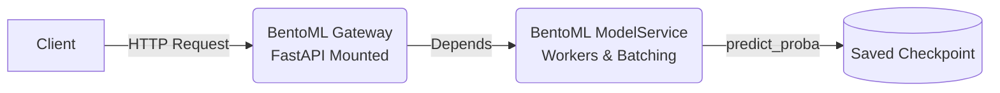

# Arabic Sentiment Analysis Model

## Serving with BentoML

The model is wrapped in a BentoML `ModelService` allowing adaptive micro-batching, while keeping the original FastAPI app structure mounted via a `Gateway`.



**To start the server locally:**
```bash
uv run bentoml serve mlops_practitioner_course.serving.service:Gateway
```

**To build a production Bento package:**
```bash
uv export --no-dev --no-hashes -o requirements.txt
sed -i '/^-e \.$/d' requirements.txt  # Remove local editable install
uv run bentoml build
```
