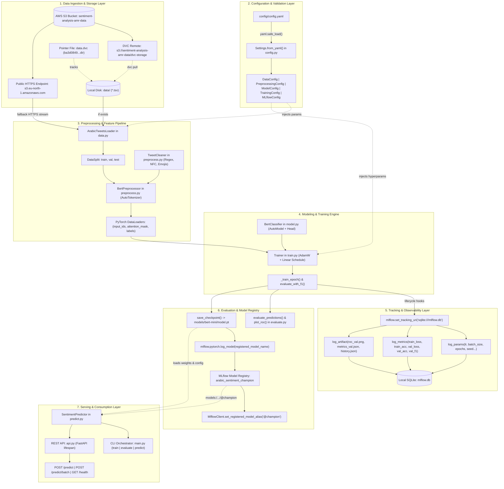
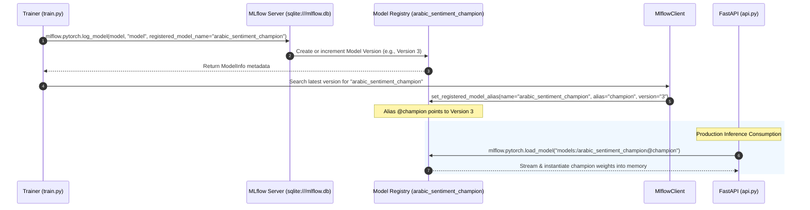
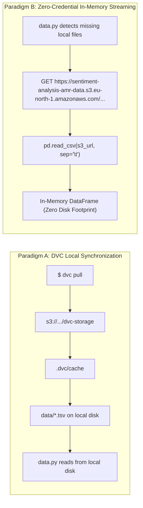

# Architectural Blueprint & End-to-End Data/Control Flow
**Project:** `mlops_course_sentiment_analysis`  
**Domain:** Arabic Tweet Sentiment Classification & Production MLOps Pipeline  
**Document Classification:** Technical Architecture & System Specification  

---

## Executive Overview

The `mlops_course_sentiment_analysis` system is an enterprise-grade MLOps reference implementation designed for end-to-end training, tracking, versioning, evaluation, and serving of Transformer-based models for Arabic Sentiment Analysis. Built around a fine-tuned Arabic BERT architecture ([`asafaya/bert-mini-arabic`](https://huggingface.co/asafaya/bert-mini-arabic) / [`asafaya/bert-base-arabic`](https://huggingface.co/asafaya/bert-base-arabic)), the system integrates modern MLOps tooling: **DVC** and **AWS S3** for content-addressable data/artifact versioning, **Pydantic v2** for strict schema validation, **PyTorch** and **Hugging Face Transformers** for model execution, **MLflow** with an ACID-compliant SQLite backend and Model Registry for experiment tracking and champion aliasing, and **FastAPI** alongside a unified CLI for batch and real-time inference.

---

## 1. End-to-End Architecture & Visual Flow Diagram

The complete operational lifecycle is organized into seven decoupled layers:



---

## 2. File-by-File Data & Control Flow Matrix

### 2.1 Executive Dependency & Flow Matrix

| File Path | Upstream Inputs / Sources | Internal Classes / Functions | Primary Outputs & Artifacts | Downstream Consumers |
| :--- | :--- | :--- | :--- | :--- |
| [`config/config.yaml`](config/config.yaml) | Filesystem | Raw YAML dictionary | Plain-text key-value hierarchy | [`src/.../config.py`](src/mlops_practitioner_course/config.py) |
| [`src/.../config.py`](src/mlops_practitioner_course/config.py) | [`config/config.yaml`](config/config.yaml) | [`Settings`](src/mlops_practitioner_course/config.py#L79), [`DataConfig`](src/mlops_practitioner_course/config.py#L25), [`ModelConfig`](src/mlops_practitioner_course/config.py#L36), [`TrainingConfig`](src/mlops_practitioner_course/config.py#L48), [`MLflowConfig`](src/mlops_practitioner_course/config.py#L73) | Strongly typed, validated `Settings` singleton | [`main.py`](src/mlops_practitioner_course/main.py), [`api.py`](src/mlops_practitioner_course/api.py), [`train.py`](src/mlops_practitioner_course/modeling/train.py) |
| [`src/.../data.py`](src/mlops_practitioner_course/data.py) | Local TSVs or S3 HTTPS URL, [`Settings`](src/mlops_practitioner_course/config.py#L79) | [`ArabicTweetsLoader`](src/mlops_practitioner_course/data.py#L43), [`DataSplit`](src/mlops_practitioner_course/data.py#L24) | Stratified [`DataSplit`](src/mlops_practitioner_course/data.py#L24) objects (`train`, `val`, `test`) | [`preprocess.py`](src/mlops_practitioner_course/preprocess.py), [`main.py`](src/mlops_practitioner_course/main.py) |
| [`src/.../preprocess.py`](src/mlops_practitioner_course/preprocess.py) | Raw texts from [`DataSplit`](src/mlops_practitioner_course/data.py#L24), HF Tokenizer | [`TweetCleaner`](src/mlops_practitioner_course/preprocess.py#L20), [`BertPreprocessor`](src/mlops_practitioner_course/preprocess.py#L46) | Batched PyTorch `DataLoader` (IDs, Attention Masks, Labels) | [`train.py`](src/mlops_practitioner_course/modeling/train.py), [`predict.py`](src/mlops_practitioner_course/modeling/predict.py) |
| [`src/.../modeling/model.py`](src/mlops_practitioner_course/modeling/model.py) | HF Hub / Cache, [`ModelConfig`](src/mlops_practitioner_course/config.py#L36) | [`BertClassifier`](src/mlops_practitioner_course/modeling/model.py#L12) (Encoder + Sequential Head) | Instantiated `torch.nn.Module`, Logits tensor `[B, 2]` | [`train.py`](src/mlops_practitioner_course/modeling/train.py), [`checkpoint.py`](src/mlops_practitioner_course/modeling/checkpoint.py) |
| [`src/.../modeling/train.py`](src/mlops_practitioner_course/modeling/train.py) | [`BertClassifier`](src/mlops_practitioner_course/modeling/model.py#L12), `DataLoaders`, [`Settings`](src/mlops_practitioner_course/config.py#L79) | [`Trainer`](src/mlops_practitioner_course/modeling/train.py#L56), [`set_seed`](src/mlops_practitioner_course/modeling/train.py#L28), [`resolve_device`](src/mlops_practitioner_course/modeling/train.py#L36) | Fine-tuned weights, MLflow Run, `@champion` alias | [`main.py`](src/mlops_practitioner_course/main.py), [`checkpoint.py`](src/mlops_practitioner_course/modeling/checkpoint.py) |
| [`src/.../modeling/checkpoint.py`](src/mlops_practitioner_course/modeling/checkpoint.py) | Trained [`BertClassifier`](src/mlops_practitioner_course/modeling/model.py#L12), [`Settings`](src/mlops_practitioner_course/config.py#L79), Disk path | [`save_checkpoint`](src/mlops_practitioner_course/modeling/checkpoint.py#L24), [`load_checkpoint`](src/mlops_practitioner_course/modeling/checkpoint.py#L38) | `models/**/model.pt` (weights + serialized Settings) | [`predict.py`](src/mlops_practitioner_course/modeling/predict.py), [`api.py`](src/mlops_practitioner_course/api.py), [`main.py`](src/mlops_practitioner_course/main.py) |
| [`src/.../modeling/evaluate.py`](src/mlops_practitioner_course/modeling/evaluate.py) | Ground truth labels, probability array | [`evaluate_predictions`](src/mlops_practitioner_course/modeling/evaluate.py#L45), [`plot_roc`](src/mlops_practitioner_course/modeling/evaluate.py#L71), [`EvaluationReport`](src/mlops_practitioner_course/modeling/evaluate.py#L24) | `metrics_{split}.json`, `roc_{split}.png` | [`main.py`](src/mlops_practitioner_course/main.py), MLflow Artifacts |
| [`src/.../modeling/predict.py`](src/mlops_practitioner_course/modeling/predict.py) | Checkpoint path or in-memory [`BertClassifier`](src/mlops_practitioner_course/modeling/model.py#L12) + [`BertPreprocessor`](src/mlops_practitioner_course/preprocess.py#L46) | [`SentimentPredictor`](src/mlops_practitioner_course/modeling/predict.py#L18) | Probabilities vector `[N]`, String labels `[N]` | [`main.py`](src/mlops_practitioner_course/main.py), [`api.py`](src/mlops_practitioner_course/api.py) |
| [`src/.../api.py`](src/mlops_practitioner_course/api.py) | HTTP Requests, `model.pt`, [`Settings`](src/mlops_practitioner_course/config.py#L79) | FastAPI application, [`lifespan`](src/mlops_practitioner_course/api.py#L38), `predict_texts` | JSON HTTP Responses (`Prediction`, batch lists) | External HTTP Clients |
| [`src/.../main.py`](src/mlops_practitioner_course/main.py) | CLI arguments, `config.yaml` | [`main`](src/mlops_practitioner_course/main.py#L121), [`train`](src/mlops_practitioner_course/main.py#L62), [`evaluate`](src/mlops_practitioner_course/main.py#L104), [`predict`](src/mlops_practitioner_course/main.py#L112) | Terminal logging, persisted runs, stdout tab-separated predictions | OS shell / CI/CD runners |

---

### 2.2 Granular Step-by-Step File Specifications

#### 1. `config/config.yaml`
- **Input / Upstream:** Edited manually by MLOps engineers or overridden via deployment scripts.
- **Internal Operations:** Structured YAML defining static values for seeds, dataset directories, preprocessing toggles, model architecture parameters, hyperparameters, evaluation thresholds, and MLflow targets.
- **Output / Downstream:** Raw textual bytes read by `Settings.from_yaml()` in [`config.py`](src/mlops_practitioner_course/config.py#L96).
- **Lifecycle Termination:** Passive configuration asset; remains static on disk.

#### 2. `src/mlops_practitioner_course/config.py`
- **Input / Upstream:** Consumes `config/config.yaml` via standard file I/O and `yaml.safe_load`.
- **Internal Operations:**
  - Instantiates Pydantic v2 schemas: [`DataConfig`](src/mlops_practitioner_course/config.py#L25), [`PreprocessingConfig`](src/mlops_practitioner_course/config.py#L32), [`ModelConfig`](src/mlops_practitioner_course/config.py#L36), [`TrainingConfig`](src/mlops_practitioner_course/config.py#L48), [`EvaluationConfig`](src/mlops_practitioner_course/config.py#L59), [`ArtifactsConfig`](src/mlops_practitioner_course/config.py#L63), [`LoggingConfig`](src/mlops_practitioner_course/config.py#L69), and [`MLflowConfig`](src/mlops_practitioner_course/config.py#L73).
  - Normalizes relative directories into absolute paths relative to `PROJECT_ROOT` via `_resolve_from_root`.
  - Derives runtime properties such as `ModelConfig.name` (mapping `"mini"` to `"asafaya/bert-mini-arabic"`) and `Settings.run_dir` (`models/bert-{version}`).
- **Output / Downstream:** Returns a validated, immutable [`Settings`](src/mlops_practitioner_course/config.py#L79) object consumed by all operational modules.
- **Lifecycle Termination:** Module functions complete immediately upon returning the schema instance.

#### 3. `src/mlops_practitioner_course/data.py`
- **Input / Upstream:** Ingests `Settings.data` configuration, reading either from the local `data/` directory or streaming over HTTPS from `https://sentiment-analysis-amr-data.s3.eu-north-1.amazonaws.com`.
- **Internal Operations:**
  - Class [`ArabicTweetsLoader`](src/mlops_practitioner_course/data.py#L43) builds file names dynamically via `FILE_TEMPLATE = "{split}_Arabic_tweets_{sentiment}_20190413.tsv"`.
  - Method `_read_file()` attempts local disk read with `pd.read_csv()`; if absent, it streams directly from S3.
  - Method `load_train_val()` applies `sklearn.model_selection.train_test_split()` with stratification on `df["label"]` and fixed `random_state=self.seed`.
  - Wraps results in immutable [`DataSplit`](src/mlops_practitioner_course/data.py#L24) dataclasses containing parallel lists of `texts` (strings) and `labels` (integers `0` or `1`).
- **Output / Downstream:** Emits `train`, `val`, and `test` [`DataSplit`](src/mlops_practitioner_course/data.py#L24) instances directly to [`main.py`](src/mlops_practitioner_course/main.py#L68) and [`preprocess.py`](src/mlops_practitioner_course/preprocess.py#L91).
- **Lifecycle Termination:** Releases raw DataFrames from memory once `DataSplit` lists are materialized.

#### 4. `src/mlops_practitioner_course/preprocess.py`
- **Input / Upstream:** Consumes raw string sequences from [`DataSplit`](src/mlops_practitioner_course/data.py#L24) or client requests, Hugging Face pretrained tokenizer files.
- **Internal Operations:**
  - [`TweetCleaner.__call__()`](src/mlops_practitioner_course/preprocess.py#L31): Implements Unicode NFC normalization, strips Twitter handle mentions (`@\w+`), unescapes HTML entities (`&amp;` to `&`), replaces URLs with `<URL>`, conditionally strips all Unicode emojis via `emoji.replace_emoji()`, and collapses redundant whitespace.
  - [`BertPreprocessor`](src/mlops_practitioner_course/preprocess.py#L46): Loads `AutoTokenizer.from_pretrained(model_name)` once. Method `encode()` executes tokenization with `padding="max_length"`, `truncation=True`, and returns PyTorch tensors (`input_ids`, `attention_mask`).
  - Method `build_dataloader()` constructs a `TensorDataset` and wraps it in a PyTorch `DataLoader` with deterministic batch generation via `torch.Generator().manual_seed(seed)`.
- **Output / Downstream:** Produces PyTorch `DataLoader` yield blocks: `(input_ids, attention_mask, labels)` consumed by [`Trainer`](src/mlops_practitioner_course/modeling/train.py#L56) or `(input_ids, attention_mask)` consumed by [`SentimentPredictor`](src/mlops_practitioner_course/modeling/predict.py#L18).
- **Lifecycle Termination:** Objects persist in memory during the execution lifetime of the Trainer or Predictor instance.

#### 5. `src/mlops_practitioner_course/modeling/model.py`
- **Input / Upstream:** Hugging Face Transformer backbone configuration and weights (`asafaya/bert-mini-arabic`), plus [`ModelConfig`](src/mlops_practitioner_course/config.py#L36).
- **Internal Operations:**
  - Class [`BertClassifier`](src/mlops_practitioner_course/modeling/model.py#L12) inherits from `torch.nn.Module`.
  - Supports cold architecture initialization (`pretrained=False` via `AutoConfig`) to avoid downloading weights when restoring from checkpoints.
  - Reads encoder width dynamically (`self.bert.config.hidden_size`) and appends a classification head:
    $$\text{Logits} = \mathbf{W}_2 \cdot \text{Dropout}\left(\text{ReLU}\left(\mathbf{W}_1 \cdot \mathbf{h}_{\text{[CLS]}} + \mathbf{b}_1\right)\right) + \mathbf{b}_2$$
  - Optionally freezes encoder backbone parameters (`param.requires_grad = False`).
- **Output / Downstream:** Forward pass yields unnormalized logits of dimension `(batch_size, 2)` consumed by `torch.nn.CrossEntropyLoss` in [`Trainer`](src/mlops_practitioner_course/modeling/train.py#L71) or softmax in [`SentimentPredictor`](src/mlops_practitioner_course/modeling/predict.py#L55).
- **Lifecycle Termination:** Remains active in VRAM/RAM across training or inference service lifecycles.

#### 6. `src/mlops_practitioner_course/modeling/train.py`
- **Input / Upstream:** Consumes instantiated [`BertClassifier`](src/mlops_practitioner_course/modeling/model.py#L12), train/val DataLoaders, and [`Settings`](src/mlops_practitioner_course/config.py#L79).
- **Internal Operations:**
  - Initializes seeds across `random`, `numpy`, and `torch` via [`set_seed`](src/mlops_practitioner_course/modeling/train.py#L28).
  - Resolves compute device (`cuda` vs `cpu`) with validation.
  - Sets up `mlflow.set_tracking_uri()` and `mlflow.set_experiment()`.
  - Inside `fit()`: opens `mlflow.start_run()`, logs all training parameters, initializes `AdamW` and `get_linear_schedule_with_warmup`.
  - Runs per-epoch forward/backward passes, clips gradients to `max_grad_norm=1.0`, computes validation loss, accuracy, and macro F1 score via [`evaluate_with_f1`](src/mlops_practitioner_course/modeling/train.py#L249).
  - Dispatches metrics to MLflow per epoch with explicit `step=epoch`.
  - Post-training: logs local plot/metric artifacts, registers the PyTorch model via `mlflow.pytorch.log_model()`, and uses `MlflowClient` to assign the alias `@champion`.
- **Output / Downstream:** Returns list of [`EpochResult`](src/mlops_practitioner_course/modeling/train.py#L44) dataclasses, registers model in MLflow Model Registry, and sets `self.run_id`.
- **Lifecycle Termination:** Closes active MLflow run context upon loop completion.

#### 7. `src/mlops_practitioner_course/modeling/checkpoint.py`
- **Input / Upstream:** [`BertClassifier`](src/mlops_practitioner_course/modeling/model.py#L12) model state, validated [`Settings`](src/mlops_practitioner_course/config.py#L79), filesystem path.
- **Internal Operations:**
  - [`save_checkpoint`](src/mlops_practitioner_course/modeling/checkpoint.py#L24): Bundles `model.state_dict()` and `settings.model_dump(mode="json")` into a single PyTorch archive via `torch.save()`.
  - [`load_checkpoint`](src/mlops_practitioner_course/modeling/checkpoint.py#L38): Reads archive with `torch.load(..., weights_only=True)` to prevent arbitrary code execution vulnerabilities, validates settings schema, builds `BertClassifier.from_config(pretrained=False)`, and loads weights via `load_state_dict()`.
- **Output / Downstream:** Produces `models/bert-mini/model.pt` on disk; reconstructs `(BertClassifier, Settings)` tuple in memory.
- **Lifecycle Termination:** Synchronous disk write/read utility; exits immediately upon completion.

#### 8. `src/mlops_practitioner_course/modeling/evaluate.py`
- **Input / Upstream:** Numpy arrays of binary ground-truth labels and continuous prediction probabilities.
- **Internal Operations:**
  - [`evaluate_predictions`](src/mlops_practitioner_course/modeling/evaluate.py#L45): Applies classification threshold, calculates accuracy, ROC-AUC, precision, recall, F1, 2x2 confusion matrix, and positive rate.
  - Generates immutable [`EvaluationReport`](src/mlops_practitioner_course/modeling/evaluate.py#L24) with a built-in `.save(path)` method.
  - [`plot_roc`](src/mlops_practitioner_course/modeling/evaluate.py#L71): Uses Matplotlib's object-oriented `Figure` API (headless, thread-safe, no GUI backend needed) to render ROC curves with AUC annotations.
- **Output / Downstream:** Persists `metrics_val.json`, `metrics_test.json`, `roc_val.png`, and `roc_test.png` into the configured run directory (`models/bert-mini/`).
- **Lifecycle Termination:** Closes matplotlib figure buffers cleanly; returns Path references.

#### 9. `src/mlops_practitioner_course/modeling/predict.py`
- **Input / Upstream:** Raw text sequences or PyTorch DataLoaders, plus loaded [`BertClassifier`](src/mlops_practitioner_course/modeling/model.py#L12) and [`BertPreprocessor`](src/mlops_practitioner_course/preprocess.py#L46).
- **Internal Operations:**
  - [`SentimentPredictor.from_checkpoint`](src/mlops_practitioner_course/modeling/predict.py#L36): Factory method encapsulating device resolution, checkpoint loading, tokenizer instantiation, and threshold setup.
  - [`predict_proba_loader`](src/mlops_practitioner_course/modeling/predict.py#L48): Executes batch forward passes under `@torch.no_grad()`, extracts index-1 softmax probabilities $\mathcal{P}(\text{positive} \mid \mathbf{x})$, and concatenates them into a 1D NumPy array.
  - [`predict`](src/mlops_practitioner_course/modeling/predict.py#L61): Maps probabilities against `threshold` to return human-readable labels (`"negative"` / `"positive"`).
- **Output / Downstream:** Emits probabilities array `np.ndarray` and string labels list `list[str]` consumed by CLI and FastAPI handlers.
- **Lifecycle Termination:** Reusable inference engine held in memory for request serving.

#### 10. `src/mlops_practitioner_course/api.py`
- **Input / Upstream:** HTTP POST payloads (`PredictRequest`, `BatchPredictRequest`) and `models/bert-mini/model.pt`.
- **Internal Operations:**
  - Implements FastAPI with an `@asynccontextmanager` [`lifespan`](src/mlops_practitioner_course/api.py#L38) handler.
  - At server startup: reads `Settings.from_yaml()` and boots [`SentimentPredictor.from_checkpoint`](src/mlops_practitioner_course/modeling/predict.py#L36), caching it on `app.state.predictor`.
  - Enforces request validation using Pydantic `StringConstraints(strip_whitespace=True, min_length=1)` to reject whitespace-only tweets with HTTP 422 before reaching the model.
  - Exposes endpoints:
    - `GET /`: Metadata, model version, classification threshold.
    - `GET /health`: Health probe returning 200 OK or 503 if model is uninitialized.
    - `POST /predict`: Real-time single text classification.
    - `POST /predict/batch`: Bounded array classification (max batch size = 64).
- **Output / Downstream:** Serialized JSON responses conforming to schema `Prediction(text, label, probability)`.
- **Lifecycle Termination:** Long-running web daemon serving until terminated by SIGTERM/SIGINT.

#### 11. `src/mlops_practitioner_course/main.py`
- **Input / Upstream:** CLI flags (`--config`, `--checkpoint`, subcommands `train`, `evaluate`, `predict`), raw string arguments.
- **Internal Operations:**
  - Configures standard logging formatting via [`setup_logging`](src/mlops_practitioner_course/main.py#L32) while silencing verbose HTTP logs from Hugging Face Hub.
  - Subcommand `train`: Coordinates data loading, preprocessing, model instantiation, training execution, checkpoint saving, metric/ROC generation, and MLflow artifact synchronization.
  - Subcommand `evaluate`: Loads existing checkpoint and benchmarks performance on test splits without training.
  - Subcommand `predict`: Loads checkpoint, runs inference on positional arguments, and outputs tab-separated predictions to standard output.
- **Output / Downstream:** Emits formatted standard output, creates local disk artifacts in `models/bert-mini/`, and syncs with MLflow.
- **Lifecycle Termination:** Process exits with status code 0 upon command execution.

---

## 3. Configuration Pipeline & Variable Propagation

### 3.1 Pydantic v2 Parsing & Schema Architecture

The configuration engine ([`src/.../config.py`](src/mlops_practitioner_course/config.py)) replaces loosely typed dictionaries with a strictly validated, strongly typed hierarchical schema using **Pydantic v2**:

```
Settings (Root Model)
├── seed: int = 2020
├── data: DataConfig
│   ├── data_dir: Path = Path("data")  --> Validated by _resolve_data_dir (_resolve_from_root)
│   └── val_size: float = Field(0.1, gt=0, lt=1)
├── preprocessing: PreprocessingConfig
│   └── remove_emojis: bool = True
├── model: ModelConfig
│   ├── version: Literal["mini", "base"] = "mini"
│   ├── max_length: int = Field(128, gt=0, le=512)
│   ├── hidden_dim: int = Field(50, gt=0)
│   ├── dropout: float = Field(0.5, ge=0, lt=1)
│   └── freeze_bert: bool = False
├── training: TrainingConfig
│   ├── batch_size: int = Field(16, gt=0)
│   ├── epochs: int = Field(2, gt=0)
│   ├── learning_rate: float = Field(5e-5, gt=0)
│   ├── adam_eps: float = Field(1e-8, gt=0)
│   ├── warmup_steps: int = Field(0, ge=0)
│   ├── max_grad_norm: float = Field(1.0, gt=0)
│   ├── log_every: int = Field(20, gt=0)
│   └── device: Literal["auto", "cpu", "cuda"] = "auto"
├── evaluation: EvaluationConfig
│   └── threshold: float = Field(0.5, gt=0, lt=1)
├── artifacts: ArtifactsConfig
│   └── output_dir: Path = Path("models") --> Validated by _resolve_output_dir (_resolve_from_root)
├── logging: LoggingConfig
│   └── level: Literal["DEBUG", "INFO", "WARNING", "ERROR"] = "INFO"
└── mlflow: MLflowConfig
    ├── tracking_uri: str = "sqlite:///mlflow.db"
    ├── experiment_name: str = "arabic-sentiment-bert"
    └── registered_model_name: str = "arabic_sentiment_champion"
```

### 3.2 Parameter Injection & Propagation Trace

The following table traces how raw configuration keys in `config.yaml` propagate through Pydantic into downstream class constructors:

| YAML Key Path | Pydantic Schema Attribute | Target Constructor / Class | Parameter Injected | Concrete Runtime Behavior |
| :--- | :--- | :--- | :--- | :--- |
| `seed: 2020` | `Settings.seed` | [`set_seed()`](src/mlops_practitioner_course/modeling/train.py#L28), [`ArabicTweetsLoader`](src/mlops_practitioner_course/data.py#L50), [`BertPreprocessor`](src/mlops_practitioner_course/preprocess.py#L49) | `seed: int` | Seeds Python `random`, `numpy`, `torch`, `torch.cuda`, controls `train_test_split`, and deterministic `DataLoader` shuffling. |
| `data.data_dir` | `DataConfig.data_dir` | [`ArabicTweetsLoader`](src/mlops_practitioner_course/data.py#L50) | `data_dir: Path` | Resolved to absolute path `PROJECT_ROOT / "data"`. Controls local file search before initiating S3 fallback streaming. |
| `data.val_size` | `DataConfig.val_size` | [`ArabicTweetsLoader`](src/mlops_practitioner_course/data.py#L50) | `val_size: float` | Passed to `sklearn.model_selection.train_test_split(test_size=...)` for stratified validation splitting. |
| `preprocessing.remove_emojis` | `PreprocessingConfig.remove_emojis` | [`TweetCleaner`](src/mlops_practitioner_course/preprocess.py#L27) | `remove_emojis: bool` | Controls whether `emoji.replace_emoji(text, replace="")` executes during normalization. |
| `model.version` | `ModelConfig.version` | [`BertPreprocessor`](src/mlops_practitioner_course/preprocess.py#L49), [`BertClassifier`](src/mlops_practitioner_course/modeling/model.py#L16) | `version: str`, `model_name: str` | Evaluates property `ModelConfig.name` to index `MODEL_NAMES["mini"]` $\rightarrow$ `"asafaya/bert-mini-arabic"`. Injects model name into HF Tokenizer and AutoModel. |
| `model.max_length` | `ModelConfig.max_length` | [`BertPreprocessor`](src/mlops_practitioner_course/preprocess.py#L49) | `max_length: int` | Configures Hugging Face tokenizer padding and sequence truncation threshold ($128$ tokens). |
| `model.hidden_dim` | `ModelConfig.hidden_dim` | [`BertClassifier`](src/mlops_practitioner_course/modeling/model.py#L16) | `hidden_dim: int` | Sizes the intermediate projection layer `nn.Linear(bert_dim, 50)` in the custom classification head. |
| `model.dropout` | `ModelConfig.dropout` | [`BertClassifier`](src/mlops_practitioner_course/modeling/model.py#L16) | `dropout: float` | Configures `nn.Dropout(0.5)` probability between hidden layer and classification logits. |
| `model.freeze_bert` | `ModelConfig.freeze_bert` | [`BertClassifier`](src/mlops_practitioner_course/modeling/model.py#L16) | `freeze_bert: bool` | Sets `param.requires_grad = False` across all BERT backbone layers when `True`. |
| `training.batch_size` | `TrainingConfig.batch_size` | [`BertPreprocessor`](src/mlops_practitioner_course/preprocess.py#L49) | `batch_size: int` | Controls batch chunking size inside PyTorch `DataLoader(..., batch_size=16)`. |
| `training.learning_rate` | `TrainingConfig.learning_rate` | [`Trainer`](src/mlops_practitioner_course/modeling/train.py#L56) | `learning_rate: float` | Injected into `torch.optim.AdamW(..., lr=5e-5)`. |
| `training.device` | `TrainingConfig.device` | [`resolve_device()`](src/mlops_practitioner_course/modeling/train.py#L36), [`Trainer`](src/mlops_practitioner_course/modeling/train.py#L56), [`SentimentPredictor`](src/mlops_practitioner_course/modeling/predict.py#L23) | `device: torch.device` | Auto-detects CUDA capability; binds model and tensors to `cuda:0` or `cpu`. |
| `evaluation.threshold` | `EvaluationConfig.threshold` | [`SentimentPredictor`](src/mlops_practitioner_course/modeling/predict.py#L23), [`evaluate_predictions()`](src/mlops_practitioner_course/modeling/evaluate.py#L45) | `threshold: float` | Cut-off decision boundary: $\mathcal{P}(\text{positive}) \ge 0.5 \implies 1\text{ (positive)}$. |
| `artifacts.output_dir` | `ArtifactsConfig.output_dir` | `Settings.run_dir` property | `output_dir: Path` | Constructs destination folder `PROJECT_ROOT / "models" / "bert-mini"`. |
| `mlflow.tracking_uri` | `MLflowConfig.tracking_uri` | [`Trainer`](src/mlops_practitioner_course/modeling/train.py#L56) | `tracking_uri: str` | Passed to `mlflow.set_tracking_uri("sqlite:///mlflow.db")`. |

---

## 4. MLflow Observability & Model Registry Deep-Dive

### 4.1 Tracking Architecture: SQLite vs. Local File Store

The project explicitly implements an ACID-compliant SQLite backend store:
```python
mlflow.set_tracking_uri("sqlite:///mlflow.db")
mlflow.set_experiment("arabic-sentiment-bert")
```

#### Why SQLite was Chosen over Local Directory File Store (`mlruns/`)
1. **Model Registry Capability:** The MLflow Model Registry feature **requires** a database-backed store (SQLAlchemy supported: SQLite, PostgreSQL, MySQL). Flat file stores (`file://...` or standard `mlruns/`) cannot support Model Registry metadata, aliases, or staging transitions.
2. **ACID Transaction Guarantees:** Relational tables manage concurrent run creations, metric steps, and parameter logging without corrupting directory structures.
3. **Optimized Query Indexing:** Fast comparison of runs, search queries via `MlflowClient.search_model_versions()`, and metric history rollups.

> [!IMPORTANT]
> **Windows OS Concurrency & Single-Worker Requirement:**  
> On Windows operating systems, the NT kernel enforces strict file-locking semantics on active SQLite database files (`mlflow.db`). If multi-process web servers (e.g., `uvicorn` with `--workers > 1`) attempt concurrent write operations, Windows triggers `sqlite3.OperationalError: database is locked`. Therefore, all training pipelines and local API servers operating against SQLite on Windows must run strictly with a single worker (`--workers 1`), or transition to a hosted remote PostgreSQL instance in production.

---

### 4.2 Exact Metric, Parameter, and Artifact Telemetry

During `Trainer.fit()`, the system logs the following telemetry:

#### 1. Hyperparameters (`mlflow.log_params`)
- `learning_rate` (`float`): e.g., `5.0e-5`
- `batch_size` (`int`): e.g., `16`
- `epochs` (`int`): e.g., `2`
- `model_name` (`str`): e.g., `"asafaya/bert-mini-arabic"`
- `max_length` (`int`): e.g., `128`
- `seed` (`int`): e.g., `2020`
- `optimizer_type` (`str`): e.g., `"AdamW"`

#### 2. Per-Epoch Step Metrics (`mlflow.log_metrics(..., step=epoch)`)
- `train_loss` (`float`): Mean cross-entropy loss over training batches.
- `train_acc` (`float`): Training batch accuracy.
- `val_loss` (`float`): Total validation loss weighted by batch sizes.
- `val_acc` (`float`): Classification accuracy over stratified validation set.
- `val_f1` (`float`): Macro F1 score calculated via `sklearn.metrics.f1_score(..., zero_division=0)`.

#### 3. Persisted Artifacts (`mlflow.log_artifact`)
Post-training hooks synchronize the following artifacts from `models/bert-mini/`:
- `metrics_val.json` & `metrics_test.json`: Full evaluation reports containing precision, recall, F1, ROC-AUC, sample counts, positive rates, and 2x2 confusion matrices.
- `roc_val.png` & `roc_test.png`: Matplotlib-rendered ROC curves annotated with exact AUC values.
- `history.json`: Epoch-by-epoch loss and time breakdown.
- `model.pt`: Standalone binary checkpoint containing model state dict and serialized Pydantic settings.

---

### 4.3 Model Registration & Champion Aliasing Flow

The project implements automated model promotion using MLflow Model Aliases:



1. **Model Registration:**  
   In [`Trainer.fit()`](src/mlops_practitioner_course/modeling/train.py#L174-L179), the PyTorch model is registered directly:
   ```python
   model_info = mlflow.pytorch.log_model(
       pytorch_model=self.model,
       artifact_path="model",
       registered_model_name="arabic_sentiment_champion",
       serialization_format=mlflow.pytorch.SERIALIZATION_FORMAT_PICKLE,
   )
   ```
2. **Programmatic Promotion via Aliasing:**  
   Using [`MlflowClient`](src/mlops_practitioner_course/modeling/train.py#L182-L200), the system dynamically determines the generated version ID and tags it with `@champion`:
   ```python
   client = MlflowClient()
   client.set_registered_model_alias(
       name="arabic_sentiment_champion",
       alias="champion",
       version=str(model_version),
   )
   ```
3. **Decoupled Production Serving:**  
   Serving clients decouple themselves from specific runs, file paths, or version numbers by loading directly from the alias:
   ```python
   champion_model = mlflow.pytorch.load_model(
       "models:/arabic_sentiment_champion@champion"
   )
   ```

---

## 5. AWS S3 & DVC Integration Architecture

### 5.1 S3 Bucket Architecture & Access Policies

The cloud persistence layer resides in AWS S3:
- **Bucket Identifier:** `sentiment-analysis-amr-data`
- **Region:** `eu-north-1` (Stockholm)
- **Bucket Policy:** Configured with public read permissions (`s3:GetObject`) for dataset assets, enabling anonymous, zero-credential access for local developers and continuous integration workers.

### 5.2 DVC Remote Configuration & Content-Addressable Storage

The DVC subsystem is defined in [`.dvc/config`](.dvc/config):
```ini
[core]
    remote = s3-storage
['remote "s3-storage"']
    url = s3://sentiment-analysis-amr-data/dvc-storage
    region = eu-north-1
```

#### Content-Addressable Hashing Mechanism
DVC replaces large binaries with lightweight Git-tracked pointer files:
- **[`data.dvc`](data.dvc):**
  ```yaml
  outs:
  - md5: ba3d0849e662761f1e5a25c37b2d1d83.dir
    size: 7369776
    nfiles: 4
    hash: md5
    path: data
  ```
  Points to the four raw Arabic sentiment TSV files totaling ~7.37 MB.
- **[`models/bert-mini.dvc`](models/bert-mini.dvc):**
  ```yaml
  outs:
  - md5: fb1ffe3b4d59e001efd128a528405c8c.dir
    size: 46347918
    nfiles: 6
    hash: md5
    path: bert-mini
  ```
  Tracks trained model output directory (~46.3 MB) containing checkpoints, metrics, and plots.

### 5.3 Data Retrieval Paradigms: DVC Pull vs. In-Memory S3 Streaming

The system incorporates a robust dual-mode data ingestion pipeline:



| Dimension | Paradigm A: DVC Cache Synchronization (`dvc pull`) | Paradigm B: In-Memory HTTPS Fallback (`data.py`) |
| :--- | :--- | :--- |
| **Trigger Mechanism** | Explicit developer execution via CLI: `dvc pull` | Automatic fallback inside [`ArabicTweetsLoader._read_file()`](src/mlops_practitioner_course/data.py#L70-L96) |
| **Authentication** | Configurable (`no_sign_request true` or AWS credentials) | Completely anonymous HTTP/HTTPS (`s3:GetObject`) |
| **Disk Storage** | Persists files to disk under `data/` and `.dvc/cache/` | **Zero disk usage**; streams bytes directly into RAM |
| **Network Cost** | One-time download; subsequent runs hit local disk | Downloads per pipeline run if local disk cache is absent |
| **Primary Use Case** | Offline local training, air-gapped development, DVC pipeline DAGs | Serverless deployments, ephemeral Docker containers, lightweight CI |

---

## 6. Repository Hygiene & Ignore Policies

### 6.1 The Triad Boundary: Git vs. DVC vs. AWS S3

To prevent repository bloat, eliminate credentials leaks, and maintain high-performance git operations, the codebase strictly enforces the Triad Boundary:

```
+-----------------------------------------------------------------------------------+
|                                  THE TRIAD BOUNDARY                               |
+--------------------------+----------------------------+---------------------------+
|      1. GIT REPO         |        2. DVC LAYER        |      3. AWS S3 STORAGE    |
| (Code & Pointers)        | (Data Version Tracking)    | (Heavy Binary Payloads)   |
+--------------------------+----------------------------+---------------------------+
| * Source code (.py)      | * Hash calculation (md5)   | * Raw datasets (.tsv)     |
| * Configuration (.yaml)  | * Pointer files (.dvc)     | * DVC Cache (dvc-storage) |
| * Dependency locks (uv)  | * State tracking (dvc.lock)| * Serialized models (.pt) |
| * DVC pointers (*.dvc)   | * Remote push/pull sync    | * Headless metrics & plots|
+--------------------------+----------------------------+---------------------------+
```

### 6.2 Ignore Policies & Risk Mitigation

#### 1. Analysis of `.gitignore`
The project's [`.gitignore`](.gitignore) and subfolder ignore rules enforce strict exclusions:

```gitignore
# Python-generated files
__pycache__/
*.py[oc]
build/
dist/
wheels/
*.egg-info

# Virtual environments
.venv
/data

# Models subdirectory exclusion (models/.gitignore)
/bert-mini
```

##### Hazards Mitigated
- **Git Repository Bloat:** Excluding `/data` and `models/bert-mini` prevents tracking multi-megabyte binary datasets and model checkpoints in Git's object history (`.git/objects/`), which permanently degrades repository clone and fetch speeds.
- **Race Conditions & DB Lock Pollution:** Excluding `mlruns/` and `mlflow.db` prevents committing local SQLite state. If multiple engineers push competing SQLite binary files to Git, resolving merge conflicts is impossible without corrupting the database.
- **Platform Incompatibilities:** Ignoring `.venv` prevents committing OS-specific compiled C-extensions and system libraries.

#### 2. Analysis of `.dvcignore`
The [`.dvcignore`](.dvcignore) file defines exclusions for DVC tracking:
- Prevents DVC from calculating checksums on OS artifacts (`.DS_Store`, `Thumbs.db`), Git internal directories (`.git/`), and temporary write locks.
- Ensures hash consistency across operating systems: avoids differences in line endings or OS-specific hidden metadata altering the MD5 directory hashes (`.dir` files).

---

## 7. Execution Runbooks & Operational Commands

### 7.1 Local Development & Pipeline Execution

```bash
# 1. Sync data via DVC (optional if streaming directly from S3)
dvc pull

# Optional: Inspect S3 Bucket Contents via PowerShell without AWS credentials
# [xml]$bucketData = Invoke-RestMethod "https://sentiment-analysis-amr-data.s3.eu-north-1.amazonaws.com/"
# $bucketData.ListBucketResult.Contents | Select-Object @{Name="File Name"; Expression={$_.Key}}, @{Name="Size (KB)"; Expression={[math]::Round($_.Size / 1KB, 2)}}, @{Name="Last Modified"; Expression={$_.LastModified}} | Format-Table -AutoSize

# 2. Execute full training, validation, checkpointing, and MLflow logging
uv run mlops-practitioner-course train

# 3. Evaluate an existing checkpoint on test split
uv run mlops-practitioner-course evaluate --checkpoint models/bert-mini/model.pt

# 4. Perform CLI inference on custom Arabic text
uv run mlops-practitioner-course predict "هذا الفيلم رائع جدا واستمتعت به" "تجربة سيئة للغاية ولن أكررها"
```

### 7.2 Launching the Serving API & Inspecting MLflow

```bash
# 1. Launch FastAPI application (Single worker mandated for Windows SQLite stability)
uv run uvicorn mlops_practitioner_course.api:app --host 0.0.0.0 --port 8000 --workers 1

# 2. Query Real-Time Sentiment via cURL
curl -X POST "http://localhost:8000/predict" \
     -H "Content-Type: application/json" \
     -d '{"text": "الخدمة ممتازة وفريق العمل متعاون جدا"}'

# 3. Launch MLflow UI to inspect runs, metrics, artifacts, and @champion model
uv run mlflow ui --backend-store-uri sqlite:///mlflow.db --port 5000
```

---

## 8. Summary Checklist for Production Readiness

- [x] **Schema Validation:** Strict Pydantic v2 schemas in [`src/.../config.py`](src/mlops_practitioner_course/config.py) validate all parameters and resolve absolute root paths.
- [x] **Resilient Data Access:** Zero-credential HTTPS streaming fallback in [`src/.../data.py`](src/mlops_practitioner_course/data.py) ensures operation even when local disk datasets are unpopulated.
- [x] **Reproducible Preprocessing:** Unicode NFC normalization, mention stripping, and emoji cleaning in [`src/.../preprocess.py`](src/mlops_practitioner_course/preprocess.py) are matched between training and inference.
- [x] **Safe Serialization:** PyTorch checkpoint loading in [`src/.../checkpoint.py`](src/mlops_practitioner_course/modeling/checkpoint.py) enforces `weights_only=True` to prevent remote code execution.
- [x] **ACID Experiment Tracking:** SQLite tracking backend in [`src/.../train.py`](src/mlops_practitioner_course/modeling/train.py) enables full Model Registry support with automated `@champion` aliasing.
- [x] **Serving Decoupling:** FastAPI application in [`src/.../api.py`](src/mlops_practitioner_course/api.py) loads checkpoints once during server startup lifecycle, rejecting malformed and whitespace payloads at the perimeter.